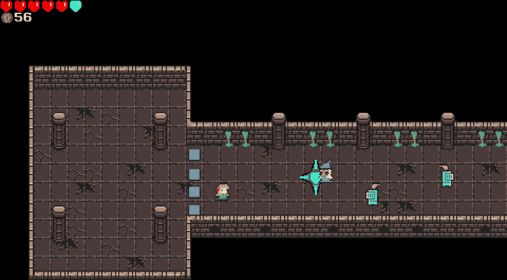
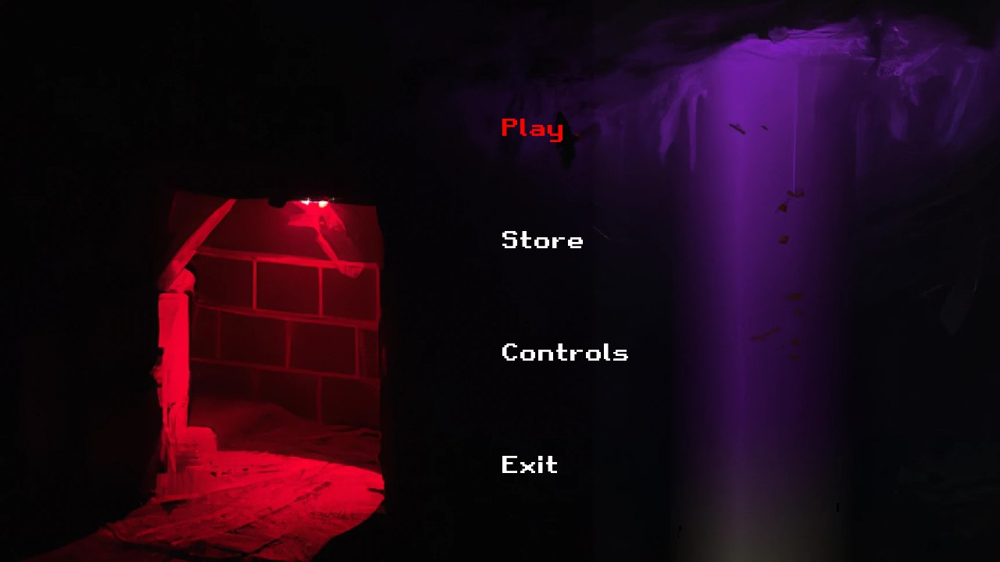
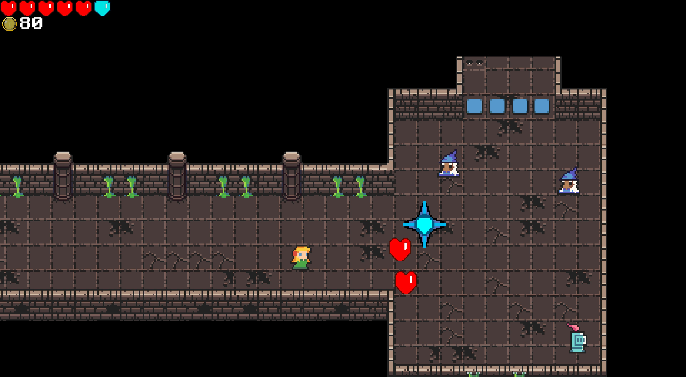
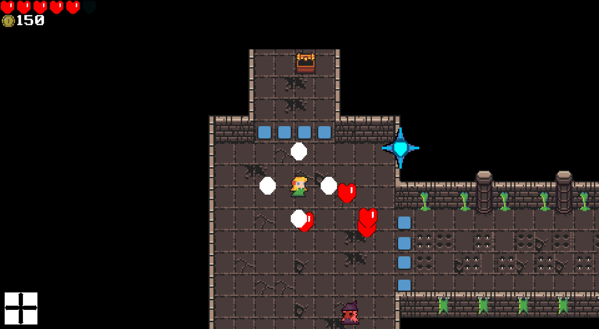
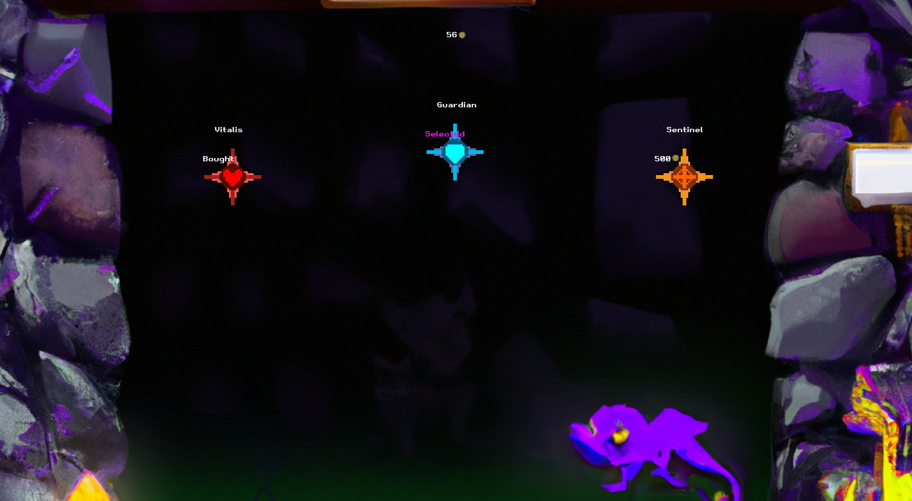

<h1 align="center">HELLROOM</h1>

<p align="center">
  A top-down bullet hell where every room locks you in until its enemies are dead,<br/>
  built from scratch in <b>C++20</b> with <b>SFML</b> and our own <b>Entity-Component-System</b> engine.
</p>

<p align="center">
  
  
  
  
  
</p>

<p align="center">
  
</p>

## About

*Escape before time runs out, and feed on the souls of your enemies to survive.*

You wake up in a dungeon of locked rooms. Each one seals its doors until every enemy inside is dead, and the clock keeps ticking while you fight. Along the way you pick up hearts and coins, open chests, pull levers, switch between three weapons (cross shot, shotgun and burst), raise a shield, and spend your coins in the store on pets that help you along the way. There's also a boss with a laser attack.

It was made in 2023 by a team of five students as a course project in the Multimedia Engineering degree at the University of Alicante.

<p align="center">
  
  
  
  
</p>

## Engine

There's no game engine underneath. SFML only provides the window, input, drawing and audio; everything else is ours, organised as an **Entity-Component-System** with independent managers and systems:

```
src/pro/Alpha/
├── main.cpp            creates the state machine and runs the loop
├── classes/
│   ├── cmp/            components: physics, render, input, AI, health, weapons, chests...
│   ├── man/            managers: game, entities, sprites, Tiled maps, input, game states
│   ├── sys/            23 systems: render, physics, collision, AI, spawn, weapon, health,
│   │                   shield, HUD, rooms, chests, levers, traps, pets, boss, effects,
│   │                   rewards, sound, saving, dialogue, animation, achievements, input
│   ├── states/         main menu, game, store, pause, controls, game over, ending
│   ├── facade/         input facade, so systems don't depend on SFML directly
│   └── utils/          A* pathfinding and iterators
├── include/            tinyxml2 (used to read Tiled maps and XML data)
└── media/              sprites, maps (.tmx), sounds and music
```

Levels are designed in [Tiled](https://www.mapeditor.org/) and loaded from `.tmx` files, and item effects are defined in XML.

### My part

The commit history shows the full picture. These are the pieces I owned:

- **Enemy AI and A\* pathfinding.** Enemies find their way to the player across the tile grid and around walls.
- **Look-ahead camera.** Instead of staying locked on the player, the camera leans towards where you're moving so you can see what's coming. It was tuned on a 21:9 monitor, so on 16:9 screens the lean is more noticeable.
- Large parts of the **HUD**, **enemy spawning** and the **game manager** that wires the systems together.

## Build and run

You need CMake, a C++20 compiler and **SFML 2.5 or 2.6** (SFML 3 changed its API and won't work).

**Linux (Debian/Ubuntu)**

```bash
sudo apt install g++ cmake libsfml-dev
cd src/pro/Alpha
cmake -S . -B build
cmake --build build
cd build && ./MiJuego
```

**Windows (MSYS2 UCRT64)**

```bash
pacman -S mingw-w64-ucrt-x86_64-{gcc,cmake,ninja,sfml}
cd src/pro/Alpha
cmake -S . -B build -G Ninja
cmake --build build
cd build && ./MiJuego.exe
```

Run the game from inside `build/`: it loads its assets from `../media`.

## Controls

| Key | Action | | Key | Action |
|---|---|---|---|---|
| **W A S D** | Move | | **Enter** | Start game / skip |
| **Arrow keys** | Shoot | | **Esc** | Pause / previous menu |
| **Space** | Sprint (buy / select in the store) | | **M** | Pause / resume music |
| **Q** | Shield | | **E** | Action (chests, levers) |

## About this repository

This is a public copy of our original coursework repository:

- The **full commit history is preserved**, with personal email addresses replaced by anonymous ones.
- Course templates, internal coursework documents and build artifacts were removed from the history.
- In 2026 I fixed a few latent bugs so it builds and runs on current compilers and on Windows: a missing include, uninitialised flags in the state machine and menus, and an empty-stack access when leaving a state. Everything else is as we left it in 2023.

## Credits

**Team J4:** Ian Bucu, Juan Manuel González Santos, Marta Pietkiewicz, Mario Martínez López and Laura Escribano Arce.

The dungeon tiles are from [DungeonTileset II](https://0x72.itch.io/dungeontileset-ii) by 0x72 (CC0). The MIT license covers the code. The rest of the sprites, sounds and music come from the original coursework, so check their sources before reusing them.
